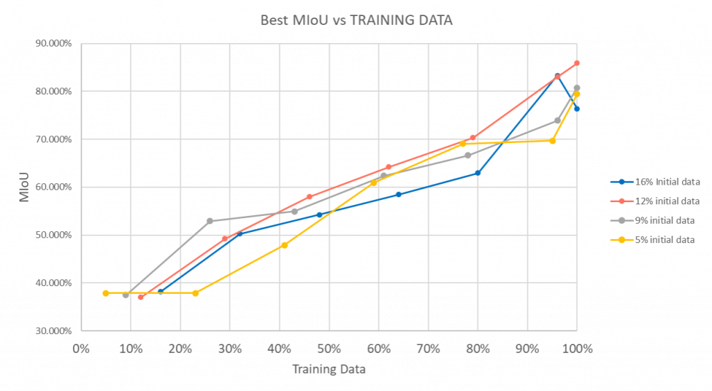

# Projects
### Tractiv

Tractiv is a startup company my team and I created during our bachelor. We made an interactive assistant for handball coaches that utilizes AI and Computer Vision to support them. The system utilised the yolov4 framework and that Nvidia Jetson Platform. Below you can find two Videos explaining the Idea. Both Videos were entirely made by us.

 
 

As we saw potential in the idea we decided to pursue it further and participate in the UT Challenge, which is an annual startup contest hosted at the University of Twente. Here we worked with the Dutch Police, Bronkhorst and Novel T to further improve our idea. In the end we managed to reach the grand final beating out over 80 other competitors.   
You can find a link to our UT challenge profile here: [UT Challenge Tractiv](https://2021.utchallenge.nl/candidate/details/18372)

### Active Learning (Thesis project)

For my bachelor thesis in Creative Technology I worked on an active learning algorithm in the point cloud environment. This project was part of the Ambient Intelligence Research Group at Saxion University.

[Publication](https://essay.utwente.nl/94542/1/Hentschel_BA_EEMCS.pdf)

During this project I learned a lot about Machine Learning and the concepts that surround it. The goal of this project was to create a computer vision algorithm that detects railway infrastructure in 3D point cloud scans. This is done to help workers with maintenance. My part in this project was to use active learning to decrease the amount of labelled data necessary. I was able to achieve a precision of upwards of 75% with only 5% labelled data.

### Computer vision + path finding algorithm

In this project I simulated a very basic grocery store environment. The goal was to automatically detect certain products through computer vision, and then combine this with a path finding algorithm to find the shortest path through the simulated supermarket. In the video below you can see this project in action.

 

To achieve this we hand labeled and trained a custom dataset which can be seen in the video below:

 

### Space in Space

In this project we were tasked to create an interactive experience that is driven by data that impacts our modern world. We chose to handle the topic of space debris and its problems. Below you can see a Video made by me that illustrates the design process:

 

### Pill Detection

For this project we set out to design a healthcare related solution. We found the problem of elderly people with impaired cognitive function and vision having a hard time finding the right medicine and/or getting confused between them. We therefore came up with a device where the pills can be inserted in any random order and are automatically sorted into various storage compartments. The device then dispenses the pills at the right amount and time set by a medical professional. Additionally the device recognises if the pill has been taken, if the pill is not taken for some time it will notify medical help. In the video we made you can see how the prototype works.

 